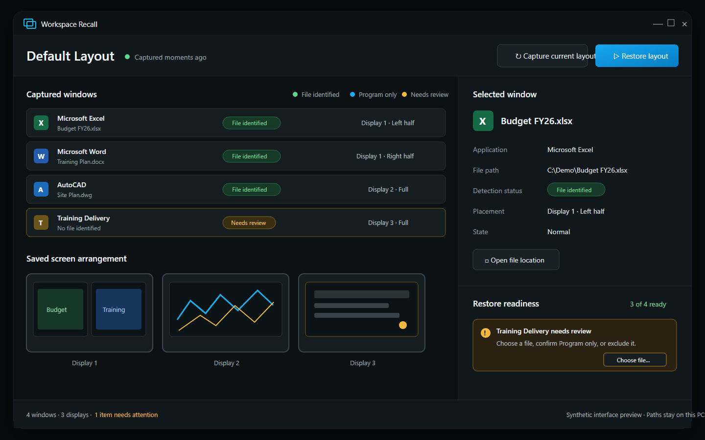

# Workspace Recall

Capture and restore a multi-monitor Windows workspace, including verified
document paths when applications expose them.

> **Early prototype — source only.** No public executable is available yet.
> Local builds are unsigned and should not be redistributed as trusted
> releases. See the [release checklist](RELEASE_CHECKLIST.md) for the signing
> and clean-machine gates required before publication.



_Synthetic interface preview using fictional files and paths. It illustrates
the current workflow without capturing a real desktop._

## Why Workspace Recall

Restoring window positions is only part of restoring a workspace. Workspace
Recall also attempts to identify the exact file behind each captured window,
then makes incomplete captures visible before restoration:

- **File identified** — a verified existing file path can be reopened.
- **Program only** — the user accepts reopening the application without
  promising its internal session or tabs.
- **Needs review** — no file has been identified and the user must choose what
  to do.
- **Excluded** — the captured window is intentionally omitted from restore.

This separates two different questions:

- **Capture completeness:** Did every eligible user-facing window appear in
  the inventory?
- **Restore readiness:** Can every included window be reopened?

## Current capabilities

- Captures eligible application windows, including minimized windows.
- Records display, position, size, Z-order, and normal, minimized, or maximized
  state.
- Attempts automatic file detection without relying on a fixed extension list.
- Uses Microsoft Office and AutoCAD automation, an optional Revit 2026 helper,
  and a generic existing-path resolver.
- Allows manual file selection, **Program only**, or exclusion when automatic
  detection is unavailable.
- Restores ready files and applications, then returns matched windows to the
  saved displays and positions.
- Keeps optional local window previews disabled by default.

## Current limitations

- One saved layout named **Default Layout**.
- File detection cannot be guaranteed for every Windows application.
- Unsaved documents have no path and cannot be reopened.
- Program-only restoration cannot promise that internal tabs, sessions, or
  unsaved state will return.
- Some applications can reopen successfully without exposing enough identity
  for reliable window placement.
- No signed installer, automatic updater, or public binary is available.

## How this differs from PowerToys Workspaces

Microsoft PowerToys Workspaces restores application positions and supports
manually configured command-line arguments, including document paths.
Workspace Recall focuses on attempting automatic, verified document-path
detection for each captured window and showing its readiness before restore.

See Microsoft's
[PowerToys Workspaces documentation](https://learn.microsoft.com/windows/powertoys/workspaces)
for the official PowerToys capabilities.

## Privacy and security

Workspace Recall has no built-in network communication, telemetry, analytics,
accounts, uploads, input hooks, startup service, or remote-control feature. It
does not request administrator privileges.

The saved layout can contain private window titles and local file, folder, and
executable paths. Optional previews can contain anything visible in a window.
Data stays under `%LOCALAPPDATA%\WorkspaceRecall`, protected for the current
Windows user, local system, and local administrators.

Restore is an explicit user action. It can launch captured applications and
allowed local document paths, then move or change the state of matched
windows. Executable, script, installer, shortcut, and registry paths are not
accepted as documents. This is defense in depth; trusted applications may
still execute active content inside otherwise allowed document formats.

Restoring a path on a network share can cause Windows and the target
application to access that share. The optional Revit integration is disabled
by default and must be enabled explicitly.

Read [PRIVACY.md](PRIVACY.md) for the data lifecycle and
[SECURITY.md](SECURITY.md) for the security boundary and private reporting
process.

## Build from source

Requirements:

- Windows 10 or 11
- .NET 8 SDK
- optionally, Autodesk Revit 2026 to build the Revit helper

Build the portable, framework-dependent output:

```powershell
.\build.ps1 -Configuration Release
```

The output is placed in `dist\WorkspaceRecall-win-x64`. The script locates a
local Revit 2026 installation when available. To provide the API location
explicitly:

```powershell
.\build.ps1 -Configuration Release -RevitApiPath 'C:\Program Files\Autodesk\Revit 2026'
```

If the Revit API assemblies are unavailable, the main app is still published
without the optional helper.

## Verify

Run the automated behavior tests:

```powershell
dotnet run --project .\tests\WorkspaceRecall.Tests\WorkspaceRecall.Tests.csproj -c Release
```

The following checks use the current desktop and saved **Default Layout**.
Review local data first because real screen or document names may be
sensitive:

```powershell
dotnet run --project .\tests\WorkspaceRecall.Tests\WorkspaceRecall.Tests.csproj -c Release -- --live
.\tests\verify_inventory_ui.ps1
```

## Contributing and support

- Read [CONTRIBUTING.md](CONTRIBUTING.md) before proposing a change.
- Use
  [GitHub Issues](https://github.com/DerrickZeng33/workspace-recall/issues)
  for reproducible bugs and scoped feature requests.
- Use
  [GitHub Discussions](https://github.com/DerrickZeng33/workspace-recall/discussions)
  for questions and general feedback.
- Report security problems through the private process in
  [SECURITY.md](SECURITY.md). Do not publish sensitive paths, layouts,
  screenshots, or proof-of-concept details in an issue.

## License

[MIT](LICENSE)

If Workspace Recall solves a problem you have, star the repository to save it
for later and help other Windows users discover it.
